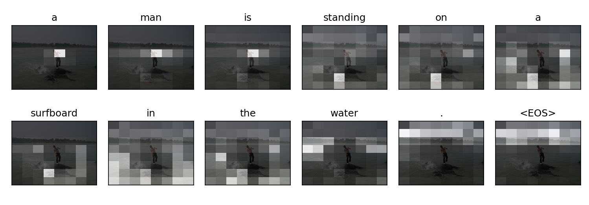

# Image-Caption-Generator

## installing requirements

`python version = 3.8`

install torch and torchvision using `pip install torch==1.7.1+cu101 torchvision==0.8.2+cu101 -f https://download.pytorch.org/whl/torch_stable.html`

## Training
Model was trained on Flicker8k Dataset [Link] (https://www.kaggle.com/datasets/adityajn105/flickr8k)

## Caption generator

Run `python main.py`

